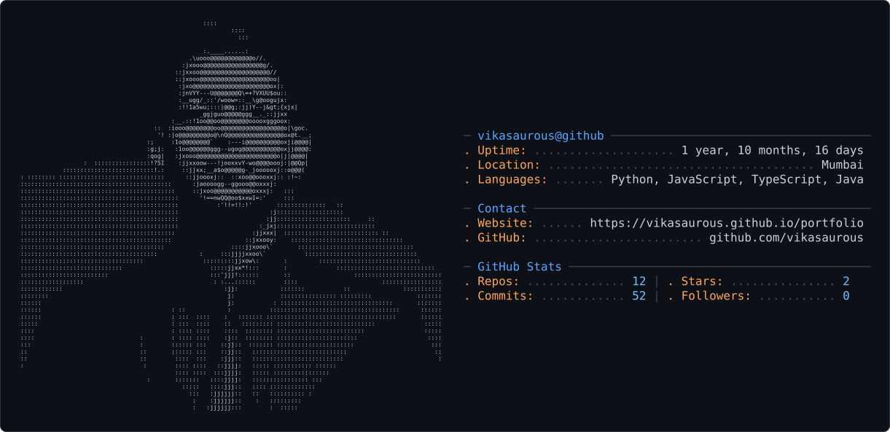

<picture>
  <source
    media="(prefers-color-scheme: dark)"
    srcset="dark_mode.svg"
  />

  <source
    media="(prefers-color-scheme: light)"
    srcset="light_mode.svg"
  />

  
</picture>
## Hi, I'm Vikas 👋
<!--
**vikasaurous/vikasaurous** is a ✨ _special_ ✨ repository because its `README.md` (this file) appears on your GitHub profile.

Here are some ideas to get you started:

- 🔭 I’m currently working on ...
- 🌱 I’m currently learning ...
- 👯 I’m looking to collaborate on ...
- 🤔 I’m looking for help with ...
- 💬 Ask me about ...
- 📫 How to reach me: ...
- 😄 Pronouns: ...
- ⚡ Fun fact: ...
-->

<picture>
  <source
    media="(prefers-color-scheme: dark)"
    srcset="https://raw.githubusercontent.com/vikasaurous/vikasaurous/output/github-snake-dark.svg"
  />

  <source
    media="(prefers-color-scheme: light)"
    srcset="https://raw.githubusercontent.com/vikasaurous/vikasaurous/output/github-snake.svg"
  />

  

</picture>

